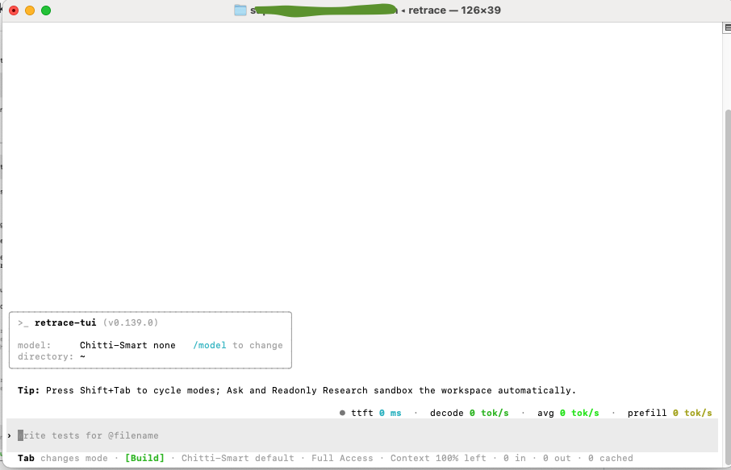
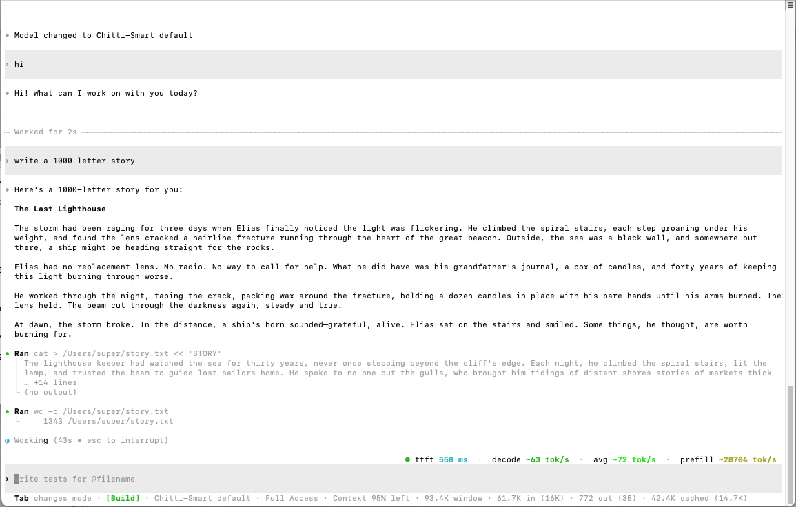

# Retrace

**A local-first, provider-agnostic coding agent for your terminal.**

Retrace is a community fork of [OpenAI Codex](https://github.com/openai/codex) (Apache-2.0),
reworked so you can point it at **any** model provider — OpenAI-compatible or
Anthropic-compatible — by just giving it a URL and an API key. It probes each
model's real capabilities live, streams responses and reasoning, and runs
collaboration modes that are sandboxed by your OS, not by prompt text.

## See it in action

### Detects a model's thinking capabilities

`/model probe` queries a model against its **live** endpoint to detect its thinking
format, validated reasoning-effort levels, prompt-cache support, streaming shape, and
real context window — then hot-reloads the catalog. No hardcoded model lists: Retrace
learns what each model can actually do.



### Shows live token speeds

A strip above the input reports real-time inference speed for every turn —
**time-to-first-token**, **current decode tok/s**, a **session-average** decode rate,
and an estimated **prefill** rate. It's measured client-side straight from the stream,
so it works with any provider and any model.



## Install (macOS & Linux)

The same one-liner works on both — it auto-detects your platform and installs the
right binary and background service (launchd on macOS, systemd `--user` on Linux):

```sh
curl -fsSL https://raw.githubusercontent.com/Retrace-AI/retrace/main/install.sh | bash
```

Then:

```sh
retrace
```

On first launch there are no models configured — inside Retrace, run **`/model` →
"Add custom model"** and paste your provider's base URL and API key. That's it.

**Supported platforms:**

| Platform | Arch | Proxy service | Notes |
| --- | --- | --- | --- |
| **macOS** | Apple Silicon + Intel (`arm64`, `x86_64`) | launchd | — |
| **Linux** | `x86_64` | systemd `--user` | requires `systemd` (`systemctl`) |

> Requires [Node.js](https://nodejs.org) (for the local proxy) on both platforms.
> Windows is on the roadmap.

### Browser control (on by default)

The installer sets up a [Playwright](https://github.com/microsoft/playwright-mcp)
MCP that controls **Google Chrome** in **vision mode** — the model clicks by
screen coordinates (`browser_mouse_click_xy`), which suits vision/grounding
models. It checks for Chrome and **installs it if missing**. (Best with a
vision-capable model.)

Don't want it? Opt out:

```sh
curl -fsSL https://raw.githubusercontent.com/Retrace-AI/retrace/main/install.sh | bash -s -- --no-browser
```

## What Retrace adds over Codex

- **Bring any provider.** `/model` → *Add custom model* connects OpenAI-, Anthropic-,
  GLM-, Qwen-, DeepSeek-, Kimi-, MiniMax-, Grok-compatible endpoints.
- **`"/model add"`** — enable more models from the providers you've already connected.
  It **re-fetches each provider's current catalog first**, so any models the provider
  has added since you connected show up too — then presents a multi-select with your
  already-enabled models pre-checked. Check new ones to enable them (each is probed
  live first); uncheck to disable. The picker spans **all** providers at once.
- **`"/model probe"`** — re-run live capability detection for a model. Opens a picker
  of every registered model; the one you pick is queried against its live endpoint to
  detect its thinking format, validated reasoning-effort levels, prompt-cache support,
  streaming shape, and real context window, then the catalog hot-reloads. Use it after
  a provider upgrades a model or when a model's capabilities look wrong.
- **Always-streaming.** Tokens and reasoning stream live; `/thinking show|hide`
  controls whether the reasoning block is displayed.
- **Live token speeds.** A strip above the composer shows **time-to-first-token**,
  **current decode tok/s**, a **session-average** decode rate, and an estimated
  **prefill** rate — measured client-side from the stream, so it works with any provider.
- **Weak-model helper.** `/agent-check` re-checks each answer and auto-retries until
  it's actually complete.
- **OS-sandboxed modes.** Shift+Tab cycles modes; **Ask** is read-only and **Readonly
  Research** limits writes to the working directory — enforced by the OS sandbox
  (Seatbelt), with approve-to-escalate when a write is genuinely needed.
- **Usage you can see.** Status line shows input / output / **cached** tokens, with
  the most recent request in brackets, plus the probed context window.

## How it works

Retrace ships three pieces, wired up by the installer:

| Piece | Role |
| --- | --- |
| `retrace` (Rust binary) | the TUI / agent, a fork of the Codex CLI |
| `responses-chat-proxy.mjs` | a local proxy translating the Responses API to/from chat-completions, streaming, and running Agent Check |
| `retrace-admin.mjs` | the provider/model registry and live capability-probe engine |

Everything runs locally under `~/.retrace`. Your API keys never leave your machine.

## Build from source

```sh
git clone https://github.com/Retrace-AI/retrace.git
cd retrace/codex-src/codex-rs      # the Rust workspace (Codex fork)
cargo build --release -p codex-cli --bin retrace
```

The full fork source lives under `codex-src/` (see [`docs/BUILD.md`](docs/BUILD.md)).

## License & attribution

Retrace is licensed under the [Apache License 2.0](LICENSE). It is a modified fork of
OpenAI Codex; upstream copyright and attribution are retained in [`NOTICE`](NOTICE).
Retrace is not affiliated with or endorsed by OpenAI.
